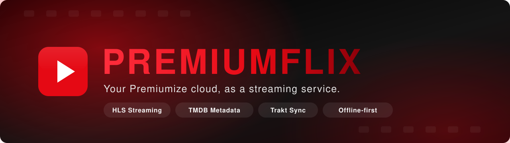
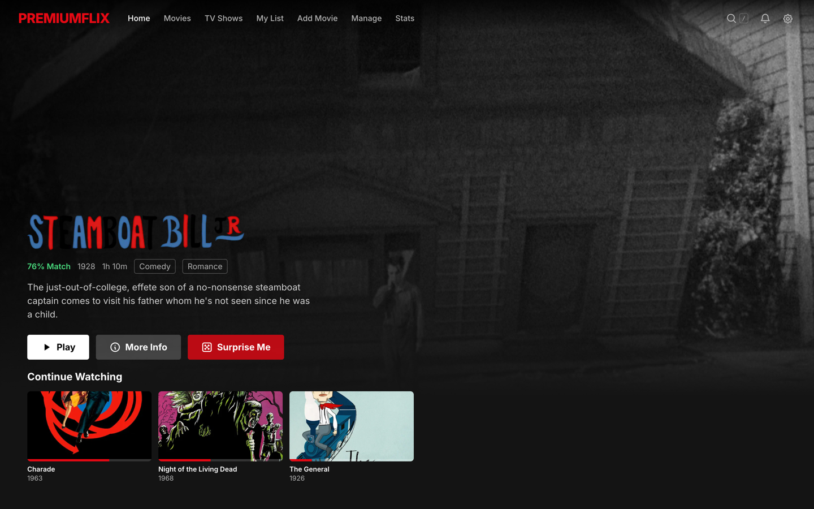
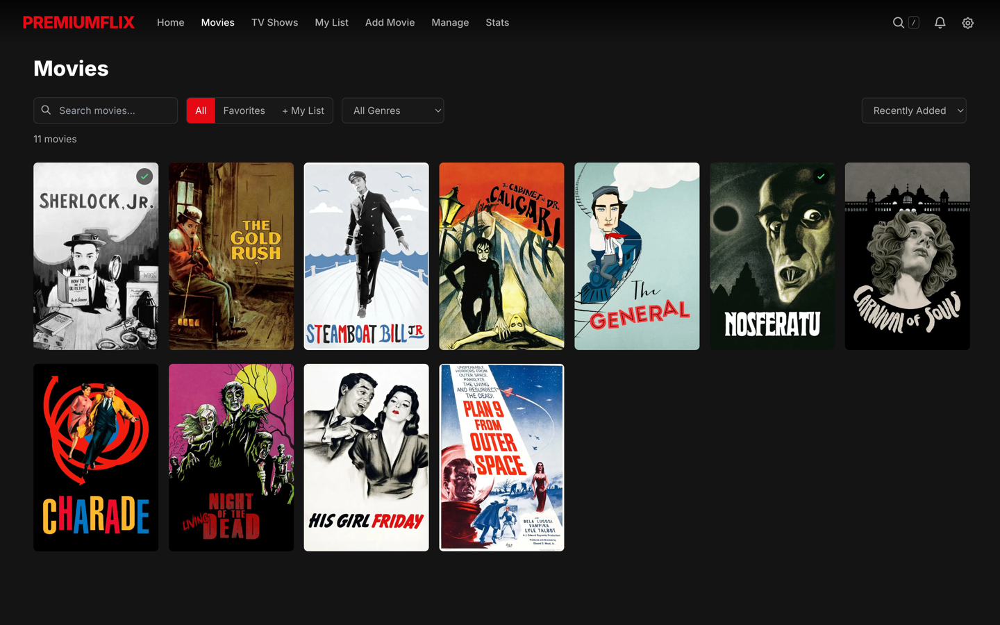
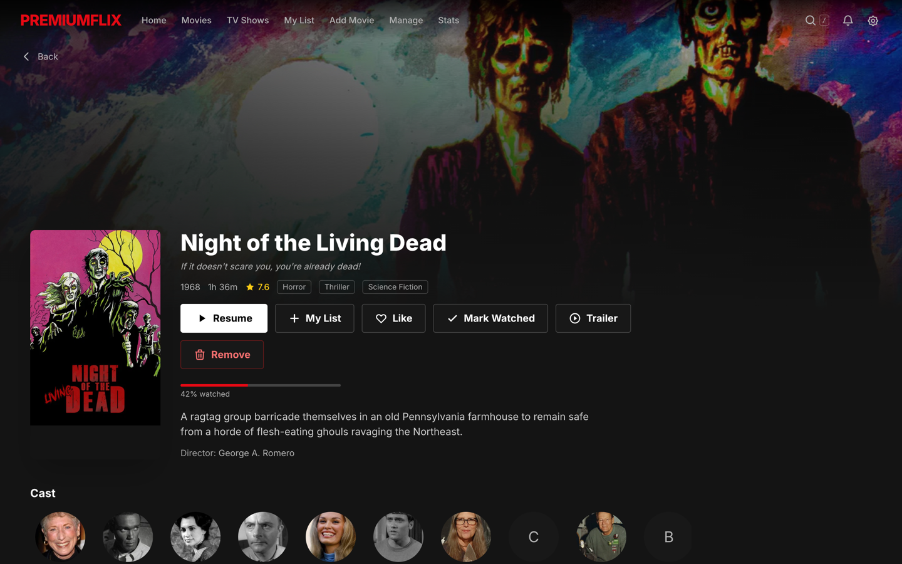
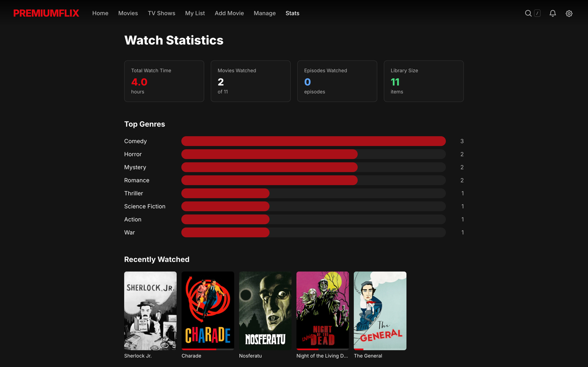
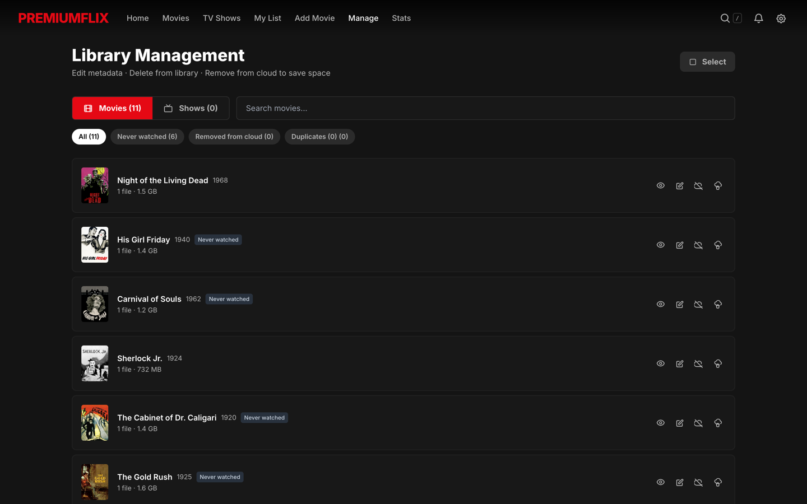
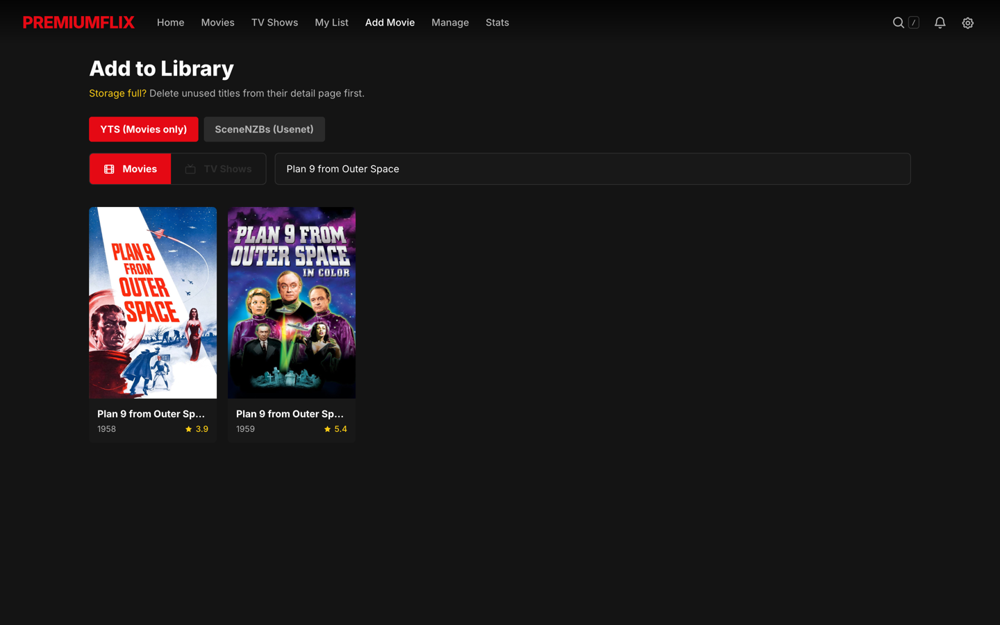
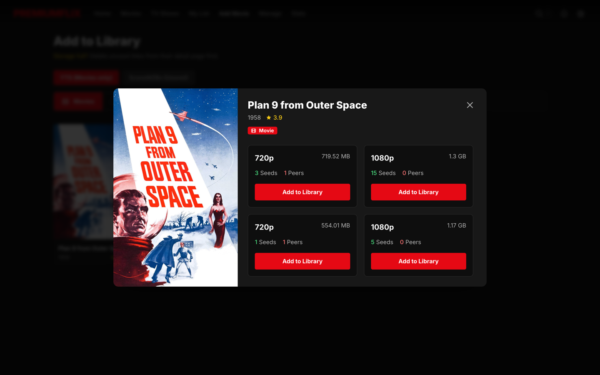
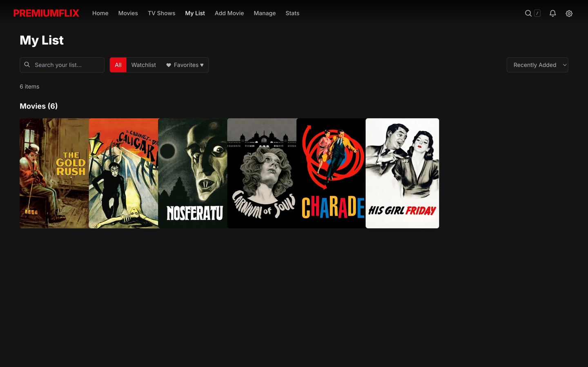

<p align="center">
  
</p>

<p align="center">
  
  
  
  
  
</p>

<p align="center">
  <a href="https://vercel.com/new/clone?repository-url=https%3A%2F%2Fgithub.com%2Fsanid%2Fpremiumflix&project-name=premiumflix&repository-name=premiumflix">
    
  </a>
</p>

---

A sleek streaming frontend that connects directly to your Premiumize.me cloud storage. It scans your Premiumize folders, matches files with TMDB, and gives you a Netflix-like interface to stream your own media library right in the browser.

## Screenshots

<p align="center">
  
</p>

<p align="center">
  
  
</p>

<details>
<summary><b>More screenshots</b> — stats, library management, adding titles</summary>

<br>

**Watch statistics** — totals, top genres and recently watched.



**Library management** — multi-select, filters, and bulk removal.



**Adding a title** — search a source, then pick a release.




**My List** — favorites and watchlist in one place.



</details>

> The library shown is made up entirely of public-domain films, so the screenshots
> stay shareable. The app itself is content-agnostic — it plays whatever is in your
> own Premiumize storage.

## What it does

- **Direct Streaming**: Plays your Premiumize video files natively using HLS with adaptive quality, hover thumbnails, and subtitle support (embedded + OpenSubtitles with sync offset).
- **Library Scanning**: Reads your chosen Premiumize folders, cleans up scene release filenames, and pulls the correct metadata from TMDB. Metadata is cached locally, so rescans only fetch what's new.
- **Fast Rescans**: Scan results are cached in IndexedDB — rescans skip already-fetched TMDB data. Optional scheduled auto-rescan (6/12/24h) notifies you about new movies and episodes while a tab is open.
- **YTS Integration**: Search for movies directly in the app. It sends the magnet link to Premiumize and updates your library in the background once the download finishes.
- **Usenet (SceneNZBs)**: Browse and add NZBs from SceneNZBs. Automatic ingestion and episode detection when transfers complete.
- **Discover & Grab**: Search results show TMDB matches you don't own yet — click one to jump straight into the release picker (YTS/NZB) and queue the download.
- **Episode Tracking**: Show cards display `12/24 EP` completeness, missing seasons appear in the episode selector, and unaired/unowned episodes show as dimmed placeholders.
- **Mark Watched**: Manual watched/unwatched toggles on details pages (whole show or per season), synced visually with green checkmarks everywhere.
- **Trakt Sync**: Connect via device-code auth — playback scrobbles automatically (watched past 80%), and you can import your entire watched history.
- **Library Management**: Multi-select, filter (never watched, cloud-only, duplicates), and bulk-remove items. Duplicate detection keeps the best copy.
- **Video Player**: Full-featured player with play/pause, seek with thumbnails, volume, quality selector, audio/subtitle tracks, playback speed, Picture-in-Picture, AirPlay, and Chromecast. Mobile-optimized with swipe gestures, double-tap to seek, and landscape detection.
- **Casting**: Built-in support for AirPlay and Chromecast.
- **Snappy UI**: Caches all metadata and watch progress locally in your browser (via IndexedDB), keeping load times instant.
- **Backups**: Library, favorites, watchlist and watch progress auto-sync to your Premiumize cloud — plus full JSON export/import in Settings.
- **Multilingual**: Supports English and German.

## Tech Stack

- React 18 + TypeScript
- Vite
- Tailwind CSS
- Dexie.js (IndexedDB)
- Hls.js
- Vercel Serverless Functions (API proxy)

## Running Locally

```bash
git clone https://github.com/sanid/premiumflix.git && cd premiumflix && npm install && npm run dev
```

You don't need to mess with config files out of the box. Just open the app and paste your Premiumize and TMDB API keys into the Settings page.

For Trakt sync, create a free app at [trakt.tv/oauth/applications](https://trakt.tv/oauth/applications) and paste its client ID in Settings → Trakt Sync (or set `VITE_TRAKT_CLIENT_ID`).

If you prefer to use environment variables, you can create a `.env` file:

```env
VITE_PM_API_KEY=your_premiumize_key_here
VITE_TMDB_API_KEY=your_tmdb_key_here
VITE_SCENENZBS_API_KEY=your_scenenzbs_key_here
VITE_TRAKT_CLIENT_ID=your_trakt_client_id_here
```

## Deployment

Click the button above to clone this repo into your own Vercel project, or deploy manually to Vercel or Netlify. Premiumize supports CORS for API requests, so the browser can talk to it directly. A `vercel.json` is included for SPA routing and the serverless API proxies (TMDB, SceneNZBs, subtitles).

Everything works with keys entered in Settings, so no environment variables are required. Set them in your Vercel/Netlify dashboard only if you'd rather keep a key server-side:

| Variable | Scope | Purpose |
| --- | --- | --- |
| `TMDB_API_KEY` | Server | Used by the `/api/tmdb` proxy so the key never reaches the browser. |
| `SCENENZBS_API_KEY` | Server | Used by the SceneNZBs proxy; required for Usenet browsing. |
| `VITE_PM_API_KEY` | Build | Pre-fills the Premiumize key instead of asking on first run. |
| `VITE_TMDB_API_KEY` | Build | Pre-fills the TMDB key (client-side calls). |
| `VITE_TMDB_USE_PROXY` | Build | Set to `true` to route TMDB calls through the serverless proxy. |
| `VITE_TRAKT_CLIENT_ID` | Build | Pre-fills the Trakt client ID for device-code auth. |

> `VITE_*` variables are baked into the client bundle at build time and are visible to anyone using the app — only use them on a deployment you keep private.
